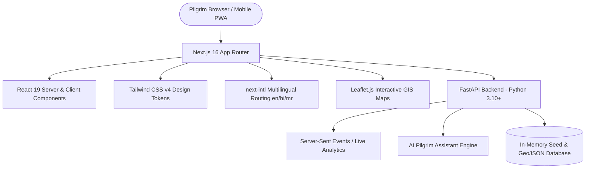

<div align="center">

# 🪔 YATRIVA — Digital Pilgrim Guide
### **Official Interactive Companion for Nashik Simhastha Kumbh Mela 2027**

[](https://nextjs.org/)
[](https://reactjs.org/)
[](https://fastapi.tiangolo.com/)
[](https://tailwindcss.com/)
[](https://www.typescriptlang.org/)
[](https://web.dev/progressive-web-apps/)
[](https://opensource.org/licenses/MIT)

<p align="center">
  <b>Empowering 30 Million+ Pilgrims with Real-Time Ghat Safety, Multilingual AI Guidance, Offline Passes, and Cultural Heritage Discovery at Nashik & Trimbakeshwar.</b>
</p>

[✨ Live Features](#-key-features--modules) •
[🏛️ Cultural Exhibits](#-cultural-story--spiritual-significance) •
[🛡️ Ground Safety Suite](#-ground-safety--pilgrim-care-suite) •
[💻 Tech Stack](#-technology-stack) •
[🚀 Quickstart](#-getting-started) •
[👥 Team](#-authors--contributors)

---

</div>

## 📖 About Yatriva

**Yatriva** is an end-to-end digital pilgrimage infrastructure and real-time pilgrim companion platform purpose-built for the **Nashik Simhastha Kumbh Mela 2027** — the largest human gathering on Earth. 

Designed specifically to operate under crowded conditions and cellular network congestion, Yatriva blends **offline-first PWA resilience**, **real-time water safety telemetries**, **multilingual AI assistance**, and **sacred cultural storytelling** into an intuitive, high-performance web application.

---

## ✨ Key Features & Modules

### 🕉️ 1. Interactive Heritage & Spiritual Significance
- **The Cosmic Story of Kumbh Mela**: 4-chapter interactive exhibit detailing the *Samudra Manthan* (Churning of the Ocean of Milk), the 4 celestial Amrita drops, and the 12-year divine cycle.
- **Simhastha Yoga Astronomy**: Vedic astrological explainer on Jupiter’s transit into Leo (*Brihaspati in Simha Rashi*) and its electromagnetic influence on sacred Godavari waters.
- **Sage Gautama & Descent of Dakshin Ganga**: The origin story of the Godavari river at Brahmagiri hill and Trimbakeshwar Jyotirlinga.
- **The 13 Holy Akhadas & Royal Shahi Snan**: Historic traditions of Shaiva and Vaishnava monastic orders, royal bathing schedules, and procession routes.
- **Virtual Pilgrimage (Nashik Darshan)**: Curated high-definition virtual video tour player for Ramkund, Trimbakeshwar, Panchavati, Kalaram Temple, and Sita Gufa.

### 🛡️ 2. Ground Safety & Pilgrim Care Suite
- 📱 **Offline Safety Pass (Lockscreen ID)**: Instant 1-tap emergency card generator for pilgrims to display emergency contacts, medical flags, and group IDs directly on their phone lockscreen without cellular connectivity.
- 🚸 **Digital Khoya-Paya (Lost & Found)**: Real-time missing person bulletin board integrated with official police control rooms and loudspeaker booths across Ramkund and Sadhugram.
- ♿ **Senior Citizen & Accessible Pilgrim Care**: Comprehensive accessibility guide with step-free wheelchair ramps, battery e-cart pickup zones, and AC rest shelters (*विश्राम कक्ष*).
- 🌊 **Ghat Water Depth & Dam Flow Alert**: Real-time water release warnings from Gangapur Dam, safe snan barricade indicators, lifebuoy stations, and changing room locations.
- 🚌 **Traffic Advisory & Feeder Shuttle Transit**: Satellite parking hubs across NH-848 / NH-60, vehicle color passes, ring-road detours, and 24x7 free feeder bus routes.
- ☀️ **Weather, Packing & Hydration Network**: 250+ free RO drinking water kiosks, ORS distribution counters, weather alerts, heatstroke prevention guidelines, and essential packing checklists.

### 🤖 3. Multilingual AI Pilgrim Assistant
- **24×7 Instant Q&A**: Answers queries regarding Shahi Snan dates, Aarti timings, nearest Ghats, shuttle routes, parking zones, and emergency helplines.
- **Offline Fallback Brain**: Local knowledge engine delivers instant emergency guidance even if the backend is unreachable.
- **Multilingual Support**: Conversational fluency in English, Hindi (हिन्दी), and Marathi (मराठी).

### 🗺️ 4. Interactive Ghat & Temple Explorer
- **Godavari Ghats Directory**: Detailed guides for Ramkund, Laxman Kund, Sita Kund, Tapovan, and Kushavarta Kund with crowd priority tags and facility breakdowns.
- **Ancient Temples Guide**: Trimbakeshwar Jyotirlinga, Kalaram Mandir, Muktidham, Kapaleshwar, Sundarnarayan, and Someshwar with live darshan guidelines and dress codes.
- **Interactive Leaflet Maps**: Geospatial map overlays with custom pins for medical camps, drinking water, police booths, parking zones, and public toilets.

### 🌐 5. Zero-Lag Multilingual Internationalization
- Fully localized in **English (`en`)**, **हिन्दी (`hi`)**, and **मराठी (`mr`)**.
- Zero-lag in-place language switching without disruptive full-page splash reloads.
- Built-in Next.js link prefetching for sub-50ms instant page navigations.

### 📊 6. Real-Time Visitor Analytics & Event Telemetry
- FastAPI-powered Server-Sent Events (SSE) broadcasting live pilgrim counter statistics and active visitor engagement telemetries.

---

## 💻 Technology Stack



### **Frontend**
| Technology | Version | Purpose |
| :--- | :--- | :--- |
| **Next.js** | `16.3.0` | React Framework (App Router, Server Components, Static Optimization) |
| **React** | `19.0.0` | UI Component Engine |
| **TypeScript** | `5.x` | Type Safety & Contract Integrity |
| **Tailwind CSS** | `4.x` | High-performance CSS Token System & Glassmorphism |
| **next-intl** | `3.26+` | Internationalization (English, Hindi, Marathi) |
| **Leaflet / React-Leaflet** | `1.9+` | OpenStreetMap Interactive GIS Map Views |
| **Lucide React** | `0.470+` | Feather-light SVG Icons |

### **Backend**
| Technology | Version | Purpose |
| :--- | :--- | :--- |
| **Python** | `3.10+` | Backend Runtime |
| **FastAPI** | `0.110+` | High-performance Asynchronous REST & SSE API |
| **Uvicorn** | `0.28+` | Lightning-fast ASGI Server |
| **Pydantic** | `2.x` | Data Validation & Schema Enforcement |

---

## 📁 Repository Architecture

```text
yatriva/
├── backend/                      # FastAPI Backend Server
│   ├── main.py                   # REST endpoints, SSE visitor stream, AI assistant router
│   ├── requirements.txt          # Python dependencies
│   └── data/                     # Seed datasets, geojson coordinates, emergency lists
│
├── frontend/                     # Next.js 16 Frontend Web Application
│   ├── app/
│   │   ├── [locale]/             # Multilingual route tree (/en, /hi, /mr)
│   │   │   ├── page.tsx          # Homepage with Hero, Stats, Exhibits & Guides
│   │   │   ├── loading.tsx       # Instant full-page circular emblem transition loader
│   │   │   ├── ghats/            # Godavari Ghats directory & snan priority
│   │   │   ├── temples/          # Sacred temples & Jyotirlinga guide
│   │   │   ├── safety-pass/      # Offline Lockscreen Emergency ID Pass generator
│   │   │   ├── lost-and-found/   # Digital Khoya-Paya bulletin & report tool
│   │   │   ├── accessibility/    # Senior citizen care, e-carts & ramps
│   │   │   ├── water-safety/     # Dam release alarms & ghat depth metrics
│   │   │   ├── traffic-advisory/ # Parking satellite hubs & shuttle schedules
│   │   │   ├── weather-health/   # Free drinking water kiosks & health advisory
│   │   │   ├── transport/        # Bus, rail, highway routes & travel scenarios
│   │   │   ├── parking/          # Parking zones, color passes & live status
│   │   │   ├── emergency/        # 1-tap SOS call cards & police booths
│   │   │   ├── assistant/        # Fullscreen AI Pilgrim Assistant chatbot
│   │   │   ├── culture/          # Deep heritage articles & Vedic histories
│   │   │   └── about/            # Team, architecture & platform mission
│   │   ├── globals.css           # Custom theme colors, scrollbars & keyframes
│   │   └── layout.tsx            # Root HTML & SEO metadata
│   │
│   ├── components/
│   │   ├── layout/               # Header, SidebarNav, BottomNav, Footer
│   │   ├── ui/                   # KumbhStoryInteractive, KumbhLoader, QuickActionTile...
│   │   ├── map/                  # Leaflet interactive map components
│   │   └── safety/               # Safety pass card & canvas export
│   │
│   ├── messages/                 # i18n Dictionary Translations
│   │   ├── en.json               # English translations
│   │   ├── hi.json               # Hindi translations (हिन्दी)
│   │   └── mr.json               # Marathi translations (मराठी)
│   │
│   ├── public/                   # Static assets, WebP illustrations, icons
│   │   ├── images/               # Authentic paintings, backgrounds, team photos
│   │   └── manifest.json         # PWA Manifest configuration
│   │
│   ├── next.config.ts            # Next.js compiler & webpack optimizations
│   └── package.json              # NPM dependencies & scripts
│
├── DEPLOYMENT.md                 # Production deployment & cloud hosting guide
└── README.md                     # Project documentation
```

---

## 🚀 Getting Started

### Prerequisites
- **Node.js**: `v18.18.0` or higher
- **Python**: `3.10` or higher
- **Git**

### 1. Clone the Repository
```bash
git clone https://github.com/Atharvasurya/yatriva.git
cd yatriva
```

### 2. Backend Setup (FastAPI)
```bash
# Navigate to backend directory
cd backend

# Create and activate virtual environment
python -m venv venv
# On Windows:
.\venv\Scripts\activate
# On Linux/macOS:
source venv/bin/activate

# Install dependencies
pip install -r requirements.txt

# Start FastAPI server on port 8000
python -m uvicorn main:app --host 127.0.0.1 --port 8000 --reload
```
*The FastAPI backend documentation will be live at `http://127.0.0.1:8000/docs`.*

### 3. Frontend Setup (Next.js)
```bash
# In a new terminal window, navigate to frontend directory
cd frontend

# Install Node packages
npm install

# Start Next.js development server
npm run dev
```
*The web application will be accessible at `http://localhost:3000`.*

### 4. Build for Production
```bash
cd frontend
npm run build
npm run start
```

---

## 🔒 Offline-First Architecture & Performance

- **Progressive Web App (PWA)**: Automatically caches static assets, temple guides, maps, and offline lockscreen ID tools for zero-connectivity situations.
- **Smart Link Prefetching**: All navigation cards and links prefetch route data automatically in the viewport, enabling seamless instant navigation.
- **Client Session Suppression**: Suppression flags ensure that switching languages or toggling localized content occurs without jarring full-screen loader flashes.

---

## 👥 Authors & Contributors

<table align="center">
  <tr>
    <td align="center" width="300">
      
      <br />
      <b>Atharva Ravindra Suryawanshi</b>
      <br />
      <sub>Full-Stack Developer & Cloud Architect</sub>
      <br />
      <a href="mailto:atharvasuryawanshi@gmail.com">atharvasuryawanshi@gmail.com</a>
    </td>
  </tr>
</table>

---

## 📰 Press & Media Coverage

- **Divya Marathi (Dainik Bhaskar Group)**: [नाशिक कुंभमेळा २०२७: अथर्व सूर्यवंशी यांनी विकसित केले 'यात्रिवा' डिजिटल व्यासपीठ (Nashik Kumbh Mela 2027: Atharv Suryavanshi develops Yatriva Digital Platform)](https://divyamarathi.bhaskar.com/dvm-originals/news/nashik-kumbh-mela-2027-atharv-suryavanshi-yatriva-digital-platform-138873995.html)

---

## 📜 Disclaimer & Acknowledgement

> **Notice**: Yatriva is an independent, community-driven digital visitor guide developed to assist pilgrims during the Nashik Simhastha Kumbh Mela 2027. It is not affiliated with, endorsed by, or connected to any government authority, police department, or religious organisation. Emergency contact details and public safety advisory numbers are compiled from public civic directories.

---

<div align="center">
  <b>Made with devotion and technology for pilgrims across the world. 🙏 Har Har Gange! जय गोदावरी!</b>
</div>
